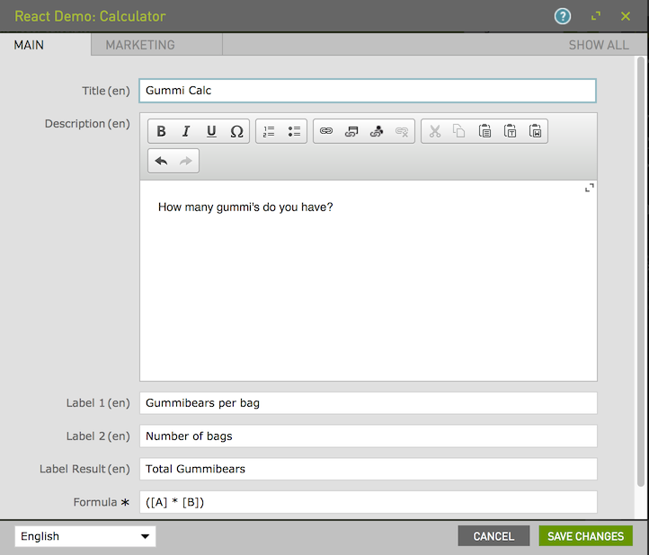
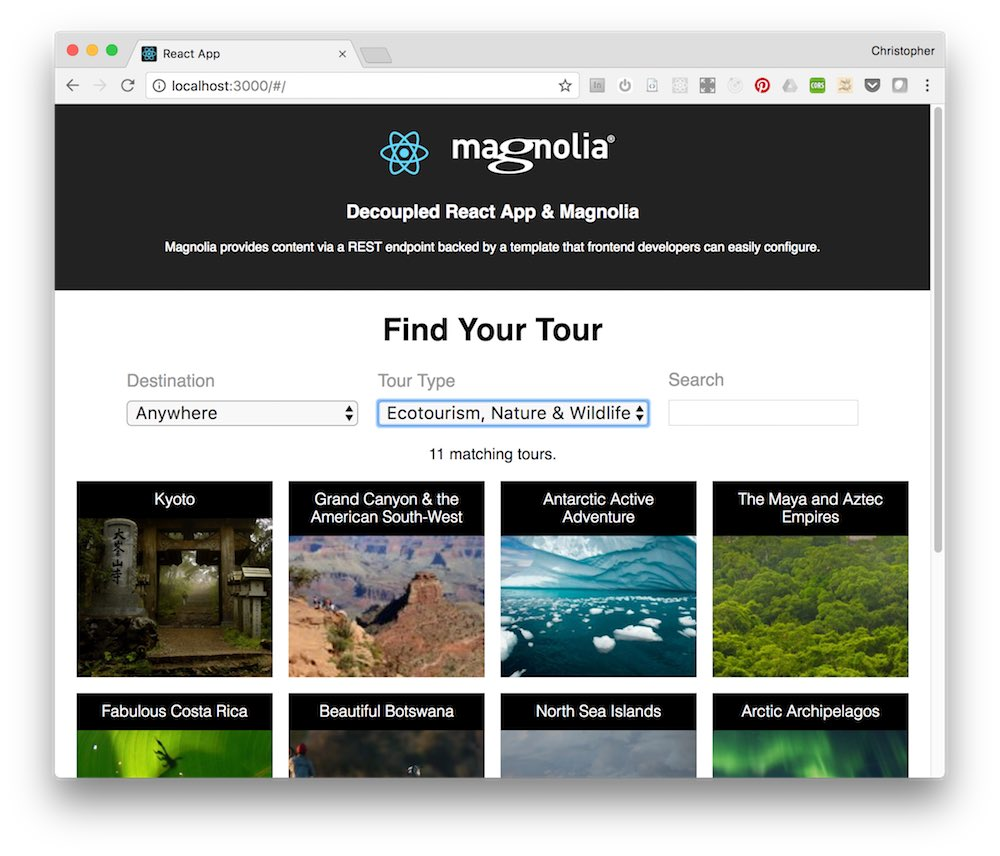

# react-demos

Demonstrates how you can *Content manage your React app*.

Using three *techniques*:
* __Magnolia Components__: Magnolia components can encapsulate React Apps, allowing content authors to configure them and add them to pages.
* __Magnolia Page__: A SPA (single page app) React app can be supplied in a Magnolia page template.
* __Decoupled__: An independent React App accesses Magnolia stored content in a 'headless'/'decoupled' fashion.

With these key *use cases* :
* __Content Pool__: Content can be managed in a Magnolia content app.
* __Configure__: Author can configure the formula used.
* __Labels & i18n__: Author can supply labels for apps, and in multiple languages.
* __Marketing__: Author can supply 'Marketing promotion content' in the form links, texts and images.

# Features - 1. Magnolia Components

## react-calculator

A simple web based calculator that applies an author specified formula to two values.

## react-tour-search

A widget which lists content from a REST source and allows filtering via a `search` input field.

# Features - 2. Magnolia Page

A Magnolia page template that delivers a single page app. The tours content is rendered directly in the page via template script so no REST call is required.

# Features - 3. Decoupled / Headless

A React app running on another server gets content from Magnolia content apps via REST calls.

# Demo - Magnolia Components and Page
Install the Magnolia CLI globally with `npm install @magnolia/cli -g`. This installs the `mgnl` command.

Get a Magnolia server by running `mgnl jumpstart` in this directory. Or point your existing Magnolia instance to the provided `light-modules` directory.

Install the jsonfn jar included in `_dev/jars/magnolia-jsonfn-1.0.7.jar` in your webapp.
(Copy it to `react-demos/apache-tomcat/webapps/magnoliaAuthor/WEB-INF/lib`)

Start the Magnolia server with `mgnl start`.

In the Assets app, use the `Import` action to import the `_dev/demos/` `dam.react-demo-components.xml` file.

In the 'Admin central' Pages app, use the `Import` action to import `_dev/demos/` `website.demo-react.xml` file.

In the `Pages` app, open the various pages under `demo-react` that have been imported.

(Note that 'decorations' are provided so that the two components are available in the MTK basic page, and the Travel demo pages.)

## Demo - Decoupled / Headless scenario.
Follow the above steps first.

Ensure Magnolia is running.

Open a terminal in `/react-tours-headless` directory.

Type `npm run`

A browser will open a node-based dev server running an independent React App. It get content from the Magnolia Server content apps: Tours and Tour Categories.

### Decoupled Demo Debugging
Does the page display "NOT LOADED"? Then check the browser console for errors, and review the following notes:

Note: To avoid CORS errors (like 'Cross-Origin Request Blocked'), and allow the React app which is running on a node dev server to access the independent Magnolia server, the 'proxy' feature of 'create-react-app' (or webpack?) is used. (All requests for unknown files are proxied to the specified address. The proxy is set in `react-tours-headless/package.json`). An alternative is to use Magnolia CORS filter module. For More information on the filter see: https://wiki.magnolia-cms.com/display/WIKI/CORS+filter+documentation

Ensure that the base url to access the content on the Magnolia server is correct: In file `/react-tours-headless/public/index.html`, check that the `window.MAGNOLIA_BASE_URL` has the correct value for your server. (Probably it does, default is `magnoliaAuthor`. And that with the proxy will go to `http://localhost:8080/magnoliaAuthor`)

# Notes
The `react-tours-headless` and the Page demo run the same React build.

That app is based on the `create-react-app` project and can be built with the `npm run build` command.

The build generated in `/react-tours-headless/build` directory has been copied to `/light-modules/react-demo-page/webresources/build`.

The app is built to accept 'parameters' via the JS window global object. In the decoupled scenario the app gets the tours content via REST. In the page template, the content is supplied directly in the page and no additional request is required.

The decoupled example, and the react-tours-search component, rely on a page for their REST content. This page acts as an endpoint. The endpoint template is supplied in `/light-modules/tours-json` module. For this demo everything is hardcoded and the path to the page in Magnolia must be  `/demo-react/tours-endpoint` (This page is supplied in the `_dev/demos/website.demo-react.xml` content bootstrap file. )

I like developing directly against the Magnolia 'author' instance.
App.js passes auth headers for the default superuser account to make this work.
For actual project you would probably simply ensure the anonymous user in Magnolia has proper access rights.

# Future Improvements

## Compiled React apps for components?
The two component examples use uncompiled React apps. In production you will actually want to use compiled React apps. In this case you will need another approach to pass in props from the CMS. I hope to update these examples at some point to use one of the following two techniques:
* http://stackoverflow.com/questions/36545118
* https://github.com/DeloitteDigitalAPAC/react-habitat

## How to use create-react-app dev server for Magnolia components?
Dev mode is so comfortable since the app is rebuilt on every change. But with webpack dev server no files are written to disk - so its not possible for the CMS to access your latest react app while you are developing.

* Here are people asking for the webpack dev server to *also* write files to disk: https://github.com/webpack/webpack-dev-server/issues/62
* Here is a webpack plugin to do this: https://github.com/gajus/write-file-webpack-plugin
* However, create-react-app hides away webpack, so to use the plugin, you must run the create-react-app `eject` command.
* I hope to provide an example of this setup in the future.

# Information on Magnolia CMS
This directory contains several Magnolia 'light modules'.

https://docs.magnolia-cms.com

Search the docs for `sharing light modules` for details on how to share and use light modules on npm and github.

# License

MIT

## Contributors

Magnolia, https://magnolia-cms.com

Christopher Zimmermann, @topherzee
